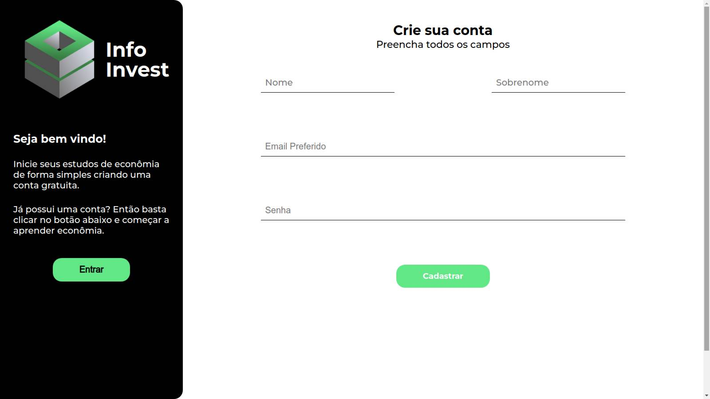

# Cadastro InfoInvest

  
  

Imagens
### Sobre o projeto:
É um site criado para o meu portifolio, ou seja, é um projeto “fantasma”, com o intuito de demonstrar uma página de cadastro e login de uma plataforma de aprendizado econômico.

### Como ver o projeto:
1. `https://github.com/thiagobenevide/cadastro-entrar.git` para clonar em sua máquina
2. <a href="https://thiagobenevide.github.io/cadastro-entrar/" target="_blank">Clique aqui<a> para acessar o site e realizar os seus testes como githubpages

### Porque foi criado:
O principal objetivo é compreender as etapas de criação de uma página de login desde a ideia inicial, até a finalização do projeto.

### Softwares utilizados:
1. Figma - para a modelagem.
2. Gimp - para criação da logo.
3. VScode - IDE para a codificação.
4. Git - para o versionamento.
5. Onlyoffice - para documentação e pesquisa.

### Linguagens utilizadas:
1. HTML5 - para a estrutura dos dados e entradas.
2. CSS3 - para o designer.

### Observações importantes:
1. Houve a necessidade de utilizar flex-box e grid para organizações de itens em css.
2. A empresa não existe até o momento da criação deste arquivo.
3. Responsividade criada para celulares, tablets, TVs, computadores e notebooks.
